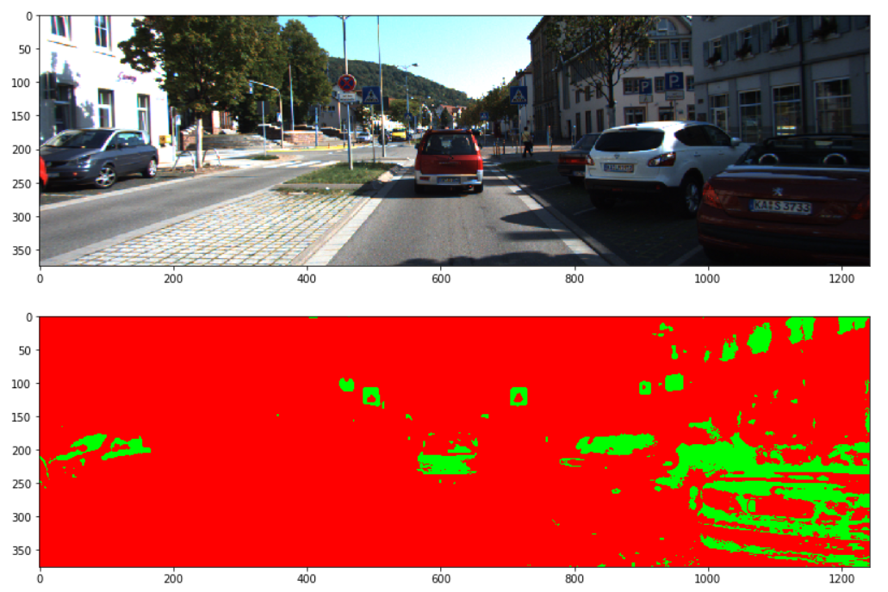

### Histogram of Oriented Gradients (HOG)

#### 1. Explain how (and identify where in your code) you extracted HOG features from the training images.

The code for this step is contained in cells # through # of the IPython notebook.  

I started by reading in all the `vehicle` and `non-vehicle` images.  Here is an example of one of each of the `vehicle` and `non-vehicle` classes:

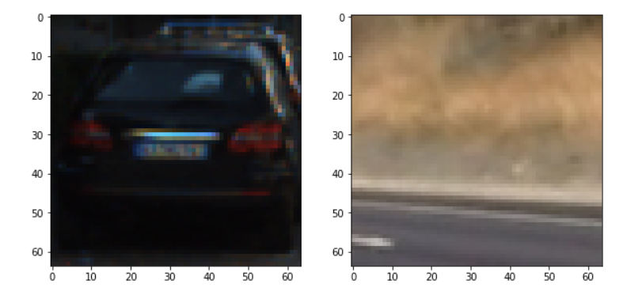

I then explored different color spaces,here is histogram for RGB color spaces,HSV color spaces and YUV color spaces.The U channel and V channel are obvious in YUV color spaces .

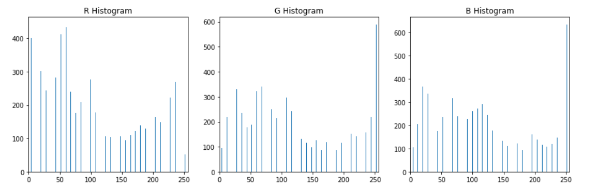

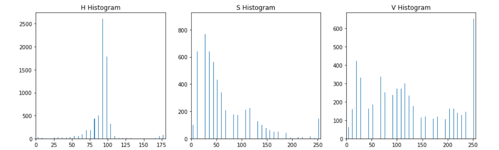

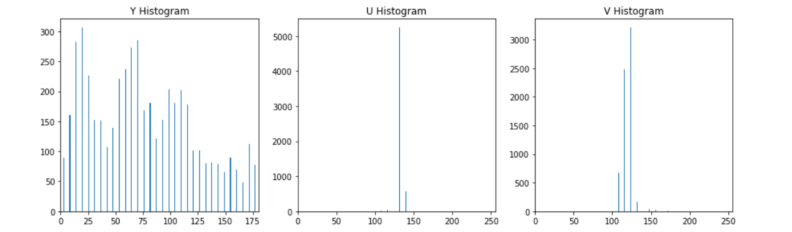

Here is an example using the `YUV` color space and HOG parameters of `orientations=15`, `pixels_per_cell=(8, 8)` and `cells_per_block=(2, 2)`:

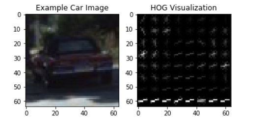

#### 2. Explain how you settled on your final choice of HOG parameters.

First I set  `orientations=15` to get more orientation features.and set a normal value `pixels_per_cell=(8, 8)` and `cells_per_block=(2, 2)`.

In addition,`block_norm ` parameters set to `L2-Hys` is bad than set to `L1`.

#### 3. Describe how (and identify where in your code) you trained a classifier using your selected HOG features (and color features if you used them).

first,I use `StandardScaler()` Normalize data to balance features.

second ,use `train_test_split()` split train datas and test datas.

third,I train a SVC classifier .

finally ,I get a accuracy of SVC =  0.9944

### Sliding Window Search

#### 1. Describe how (and identify where in your code) you implemented a sliding window search.  How did you decide what scales to search and how much to overlap windows?

first use a small window to search,like this:

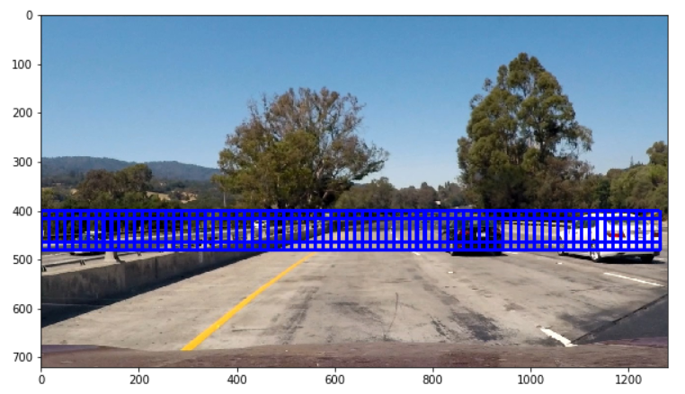

and use a big window to search :

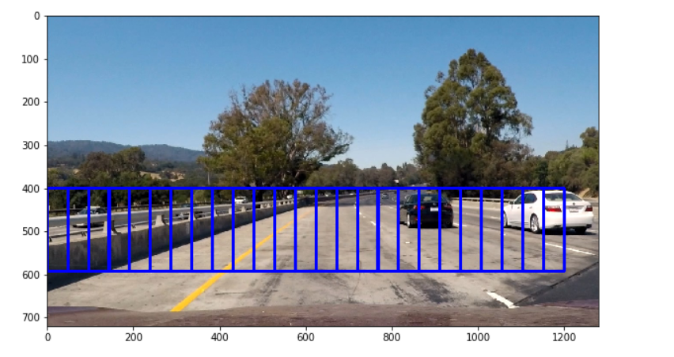

Finally, select several windows between the small window and large window.

#### 2. Show some examples of test images to demonstrate how your pipeline is working.  What did you do to optimize the performance of your classifier?

When I finished the sliding window, I found a lot of false detections.

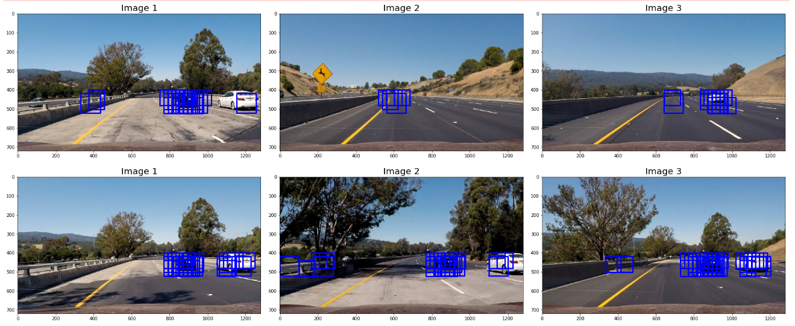

After that I used a heat map to remove false detections,like this:

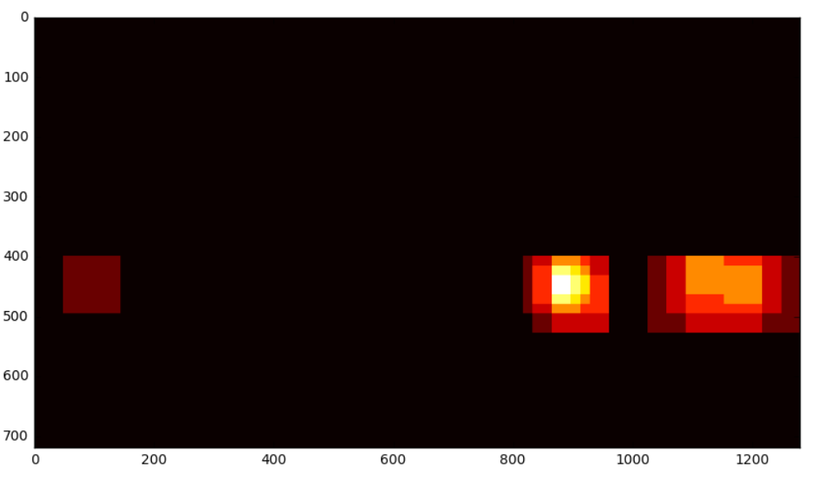

And this is the optimized detection.

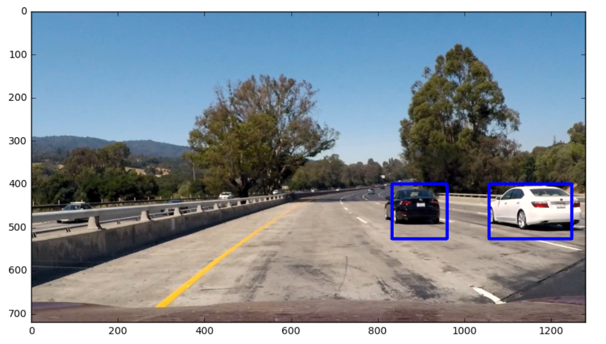

### Video Implementation

#### 1. Provide a link to your final video output.  Your pipeline should perform reasonably well on the entire project video (somewhat wobbly or unstable bounding boxes are ok as long as you are identifying the vehicles most of the time with minimal false positives.)
Here's a [link to my video result](./result.mp4)

#### 2. Describe how (and identify where in your code) you implemented some kind of filter for false positives and some method for combining overlapping bounding boxes.

When processing the video, it was found that some frame detections were undetectable, and some frames detected signals were very weak, so I superimposed past 7 to 8 frames of data to stabilize the detection results.After doing so, the effect can also be.

---

### Discussion

#### 1. Briefly discuss any problems / issues you faced in your implementation of this project.  Where will your pipeline likely fail?  What could you do to make it more robust?

The problems that I faced while implementing this project were the hog detection very inaccurate,it is very easy to identify the background as a vehicle, and finally found out from google that setting the parameter block_norm in the hog function to L1 would be much better.

The pipeline is probably most likely to fail  in places with strong sunlight and dark lighting. It may not be recognized when vehiclesgo uphill or downhill.In addition,the speed of recognition is very slow.

Here are some ideas for improving model performance:

1.  Anticipate the location of the vehicle to reduce the search area.
2.  Use c / c ++ language to speed up the algorithm.
3.  Use neural networks to improve vehicle identification accuracy.

